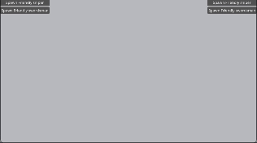

# open-combat-engine
Combat engine for Godot 4.x, with examples. Everything is completely open source.

# Setup
1. Use the [Godot Engine .NET / mono build](https://godotengine.org/download). **You can still use GDScript with Mono build.**
2. Download and run the [.net 7.0 SDK](https://dotnet.microsoft.com/en-us/download).
3. Open the Godot project located at `src/project.godot`
4. Build your C# scripts by pressing `Alt` + `B`, or click the square _Build_ button in the top-right corner.
5. Run the project by pressing `f5` or pressing the play button near the top right of the Godot window.

If you have problems setting up or run into bugs, please [create an issue](https://github.com/wadlo/open-combat-engine/issues/new) or reach out on [our discord](https://discord.gg/h3d8bTbcE2).

# Features
- Enemy AI movement
- Auto targetting enemies by group
- Projectile firing and spawning
- Usable items framework with charging, ammo, recoil, and reloading

# Examples
- Clash -- An example with swordsmen and archers that can be spawned by both sides.

The following demos are in progress:
- Diep -- A demonstration of how a game like diep.io could be built using the framework. Multiplayer not included. (In progress)
- Gungeon -- Simple player movement and enemy auto-targeting the player. Similar to Enter the gungeon. (In progress)

# Contribute
For feature requests, or to contribute, [join the discord](https://discord.gg/h3d8bTbcE2).
For bugs, please [create an issue](https://github.com/wadlo/open-combat-engine/issues/new).
